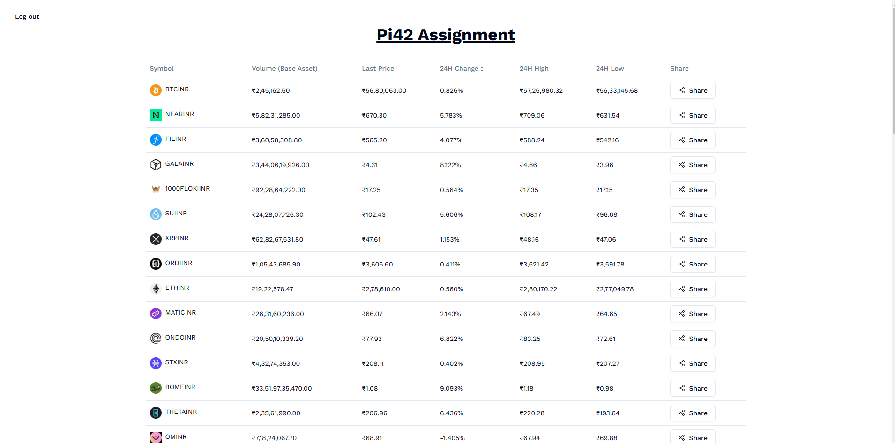

# Pi42 Assignment

## Task

Create a web application that uses firebase for authentication. Once after the authentication is successful, add a page with all the crypto contracts (tokens listed in Pi42) with their live pricing coming from Pi42 web socket. Check out the browser network tab to filter out websocket data. Typescript/Golang is preferred. If you are comfortable in any strongly typed language, that is fine as well. We use typescript(nestjs/nextjs) on our stack and upcoming modules are being built in Golang.

After creating the live ticker price page, add a functionality to sort the data based on 24 hour change percentage. The data should be updated through websocket in real time in the same way how do you see data on pi42.com trade screen. The page should have columns as below.

## Format

symbol name | last price | 24 hour change percentage | 24 hour volume | 24 hour high | 24 hour low | share

Every row contains details on a particular crypto contract. Add a share button in the last column where the particular crypto contract details can be shared over whatsapp with details from all the columns of the contract, like the below example. If the share is not supported by the browser, add a provision to download the content.

## Content format

Welcome to Pi42! Today's update on Bitcoin. <br/>
symbol name: BTC/INR <br/>
last price: ₹60,58,593 <br/>
24 hour change percentage: 0.01% <br/>
24 hour volume: 1,75,000 <br/>
24 hour high: ₹61,60,580 <br/>
24 hour low: ₹60,00,001 <br/>

This is a [Next.js](https://nextjs.org/) project.

## Getting Started

Install dependencies

```bash
npm install
```

Run the development server:

```bash
npm run dev
# or
yarn dev
# or
pnpm dev
# or
bun dev
```

Open [http://localhost:3000](http://localhost:3000) with your browser to see the result.

Deployed on vercel [https://pi42-three.vercel.app](https://pi42-three.vercel.app)



Email: [rkkool@outlook.com](mailto:rkkool@outlook.com)

Linkedin: [https://linkedin.com/in/git-0r](https://linkedin.com/in/git-0r)
